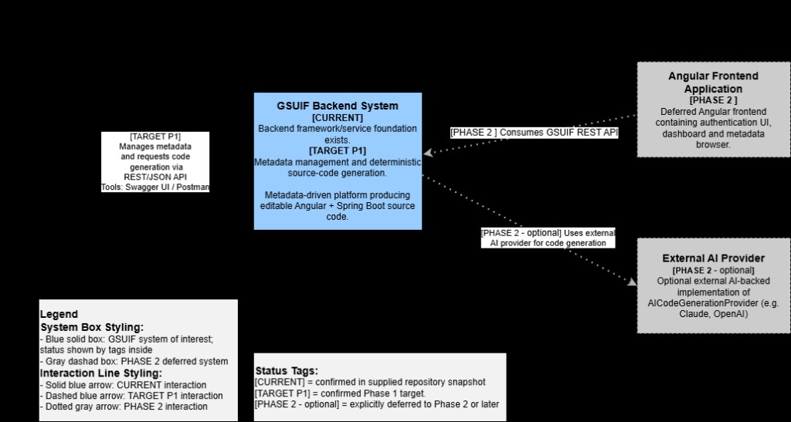
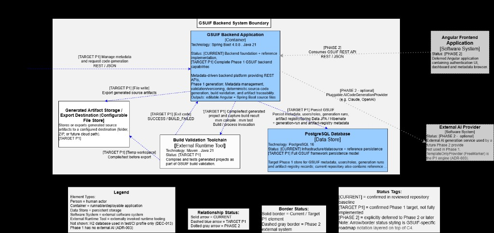
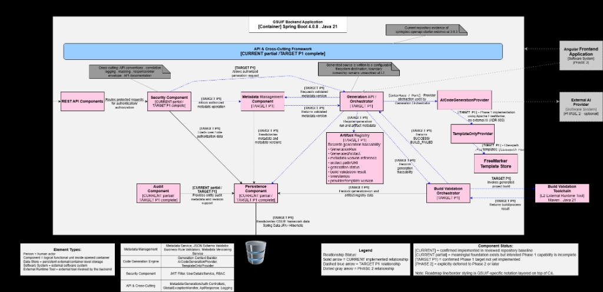

# GSUIF Architecture Diagrams

These three C4-style diagrams document the GSUIF backend system architecture
across three levels of detail: system context, containers, and components.

**Status tags used across all diagrams:**

| Tag | Meaning |
|---|---|
| `[CURRENT]` | Confirmed implemented in the reviewed repository baseline |
| `[CURRENT partial]` | Foundation exists but full Phase 1 capability is not yet complete |
| `[TARGET P1]` | Confirmed Phase 1 target — not yet implemented |
| `[PHASE 2]` | Explicitly deferred to Phase 2 or later |
| `[PHASE 2 - optional]` | Optional Phase 2 extension, not required for Phase 1 |

---

## L1 — System Context Diagram

Shows who interacts with the GSUIF Backend System and what external systems
surround it, without revealing internal structure.

### Central system

**GSUIF Backend System** `[CURRENT]`
Spring Boot backend framework and service foundation.
- `[CURRENT]` Backend framework/service foundation exists.
- `[TARGET P1]` Metadata management and deterministic source-code generation.
- Metadata-driven platform producing editable Angular + Spring Boot source code.

### Actors and external systems

| Element | Type | Status | Description |
|---|---|---|---|
| Developer / API Consumer | Person | `[TARGET P1]` | Manages metadata and requests code generation via REST/JSON API using Swagger UI or Postman |
| Angular Frontend Application | Software System | `[PHASE 2]` | Deferred Angular frontend with authentication UI, dashboard, and metadata browser. Consumes GSUIF REST API |
| External AI Provider | Software System | `[PHASE 2 - optional]` | Optional external AI-backed implementation of `AICodeGenerationProvider` (e.g. Claude, OpenAI). Not used in Phase 1 — `TemplateOnlyProvider` (FreeMarker) is the Phase 1 engine (ADR-003) |

### Interactions

| From | To | Status | Protocol |
|---|---|---|---|
| Developer | GSUIF Backend System | `[TARGET P1]` | REST / JSON API |
| GSUIF Backend System | Angular Frontend Application | `[PHASE 2]` | REST / JSON |
| GSUIF Backend System | External AI Provider | `[PHASE 2 - optional]` | Pluggable `AICodeGenerationProvider` |

### Legend
- **Blue solid box:** GSUIF system of interest
- **Gray dashed box:** PHASE 2 deferred system
- **Solid blue arrow:** CURRENT interaction
- **Dashed blue arrow:** TARGET P1 interaction
- **Dotted gray arrow:** PHASE 2 interaction

---

## L2 — Container Diagram

Zooms into the GSUIF Backend System Boundary and shows the deployable
containers and data stores, plus how they relate to each other and to
external systems.

### Containers inside the system boundary

| Container | Type | Technology | Status |
|---|---|---|---|
| GSUIF Backend Application | Container | Spring Boot 4.0.8 · Java 21 | `[CURRENT]` foundation + reference implementation; `[TARGET P1]` full Phase 1 capabilities |
| PostgreSQL Database | Data Store | PostgreSQL 16 | `[CURRENT]` infrastructure + reference persistence; `[TARGET P1]` full framework persistence model |
| Build Validation Toolchain | External Runtime Tool | Maven · Java 21 | `[TARGET P1]` |
| Generated Artifact Storage / Export Destination | Configurable File Store | Folder / ZIP / future cloud path | `[TARGET P1]` |

**GSUIF Backend Application** responsibilities:
- Metadata management, validation, and versioning
- Deterministic source-code generation (Phase 1 via `TemplateOnlyProvider` / FreeMarker)
- Build validation and artifact traceability
- Outputs: editable Angular + Spring Boot source files

**PostgreSQL Database** stores:
- GSUIF metadata, users/roles
- Generation runs and artifact-registry records
- Reference implementation data

### External systems

| System | Type | Status | Description |
|---|---|---|---|
| Angular Frontend Application | Software System | `[PHASE 2]` | Deferred Angular UI consuming GSUIF REST API via REST/JSON |
| External AI Provider | Software System | `[PHASE 2 - optional]` | Pluggable `AICodeGenerationProvider` (e.g. Claude, OpenAI). Not used in Phase 1; `TemplateOnlyProvider` (FreeMarker) is the P1 engine (ADR-003) |

### Key interactions

| From | To | Status | Description |
|---|---|---|---|
| Developer | GSUIF Backend App | `[TARGET P1]` | Manage metadata and request code generation — REST/JSON |
| GSUIF Backend App | PostgreSQL Database | `[TARGET P1]` | Persist metadata registry, generation runs, artifact registry — Spring Data JPA / Hibernate |
| GSUIF Backend App | Build Validation Toolchain | `[TARGET P1]` | Compile/test generated project — `mvn compile`, `mvn test` |
| GSUIF Backend App | Generated Artifact Storage | `[TARGET P1]` | File write — export generated source artifacts |
| Build Validation Toolchain | Generated Artifact Storage | `[TARGET P1]` | Exit code `SUCCESS / BUILD_FAILED`; temp workspace compile/test before export |
| GSUIF Backend App | Angular Frontend App | `[PHASE 2]` | Consume GSUIF REST API — REST/JSON |
| GSUIF Backend App | External AI Provider | `[PHASE 2 - optional]` | Pluggable `AICodeGenerationProvider` |

### Legend
- **Element types:** Person · Container · Data Store · Software System · External Runtime Tool
- **Solid border:** CURRENT / Target P1 element
- **Dashed gray border:** PHASE 2 external system
- **Solid arrow:** CURRENT relationship
- **Dashed blue arrow:** TARGET P1 relationship
- **Dotted gray arrow:** PHASE 2 relationship

---

## L3 — Component Diagram

Zooms into the **GSUIF Backend Application** container and shows the internal
components, their responsibilities, and how they interact.

### API & Cross-Cutting layer `[CURRENT partial / TARGET P1 complete]`

| Component | Status | Responsibility |
|---|---|---|
| REST API Components | `[CURRENT partial]` | Routes protected requests for authentication and authorization |
| Security Component | `[CURRENT partial / TARGET P1]` | Allows authorized metadata operations — JWT Filter, UserDetailsService, RBAC |

Cross-cutting concerns applied across all components:
API conventions, logging, tracing, response/error envelope (`ApiResponse`), API documentation.

### Core domain components

| Component | Status | Responsibility |
|---|---|---|
| Metadata Management Component | `[TARGET P1]` | Receives validated metadata version; owns metadata state — Metadata Service, JSON Schema Validator, Business Rule Validator, Metadata Versioning Service |
| Generation API / Orchestrator | `[TARGET P1]` | Receives generation request; orchestrates the full generation run and updates metadata |
| Artifact Registry | `[CURRENT partial / TARGET P1]` | Records generation traceability: `GenerationRun`, `GeneratedArtifact`, metadata version reference, artifact path/URL, generation status, build validation result, timestamps, phase/component version |
| Audit Component | `[CURRENT partial / TARGET P1]` | Loads and saves audit data |
| Persistence Component | `[CURRENT partial / TARGET P1]` | Persists GSUIF metadata and version support — Spring Data JPA / Hibernate |

### Code generation components

| Component | Status | Responsibility |
|---|---|---|
| AICodeGenerationProvider | `[TARGET P1]` | Interface / Port / Provider abstraction used by Generation Orchestrator. Phase 1 implementation uses Apache FreeMarker — no external AI (ADR-003) |
| TemplateOnlyProvider | `[TARGET P1]` | Phase 1 concrete implementation of `AICodeGenerationProvider`; invokes FreeMarker templates |
| FreeMarker Template Store | `[TARGET P1]` | Stores and provides FreeMarker `.ftl` templates used for code generation |
| Build Validation Orchestrator | `[TARGET P1]` | Triggers the external Build Validation Toolchain; returns `SUCCESS / BUILD_FAILED` result |

### External elements visible at this level

| Element | Type | Status |
|---|---|---|
| Angular Frontend Application | Software System | `[PHASE 2]` |
| External AI Provider | Software System | `[PHASE 2 - optional]` |
| Build Validation Toolchain | External Runtime Tool | `[TARGET P1]` — Maven · Java 21 |
| PostgreSQL / H2 Database | Data Store | `[CURRENT]` — Spring Data JPA / Hibernate |

### Component status legend

| Status | Meaning |
|---|---|
| `[CURRENT]` | Confirmed implemented in reviewed repository baseline |
| `[CURRENT partial]` | Meaningful foundation exists but Phase 1 capability is incomplete |
| `[TARGET P1]` | Confirmed Phase 1 target, not yet implemented |
| `[PHASE 2]` | Explicitly deferred to Phase 2 or later |

### Relationship legend

| Line style | Meaning |
|---|---|
| Solid arrow | CURRENT implemented relationship |
| Dashed blue arrow | TARGET P1 relationship |
| Dotted gray arrow | PHASE 2 relationship |
